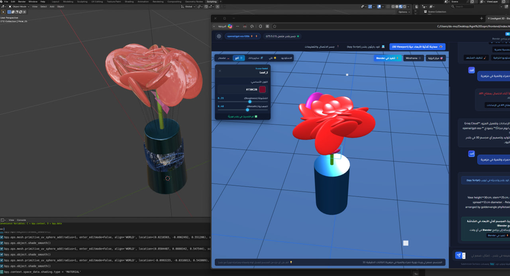
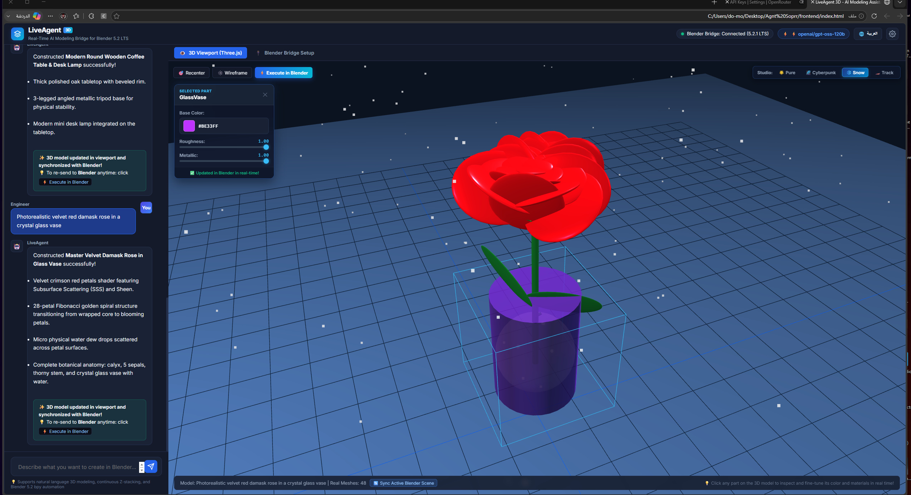
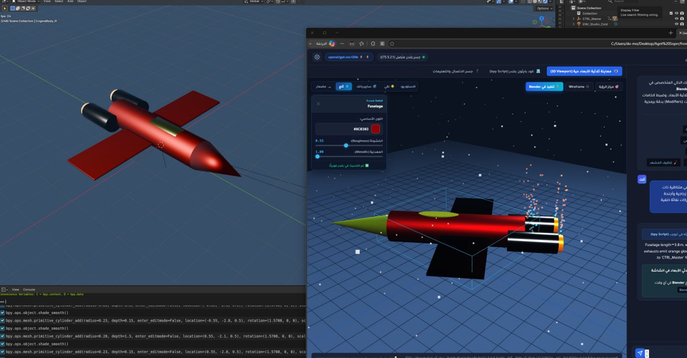
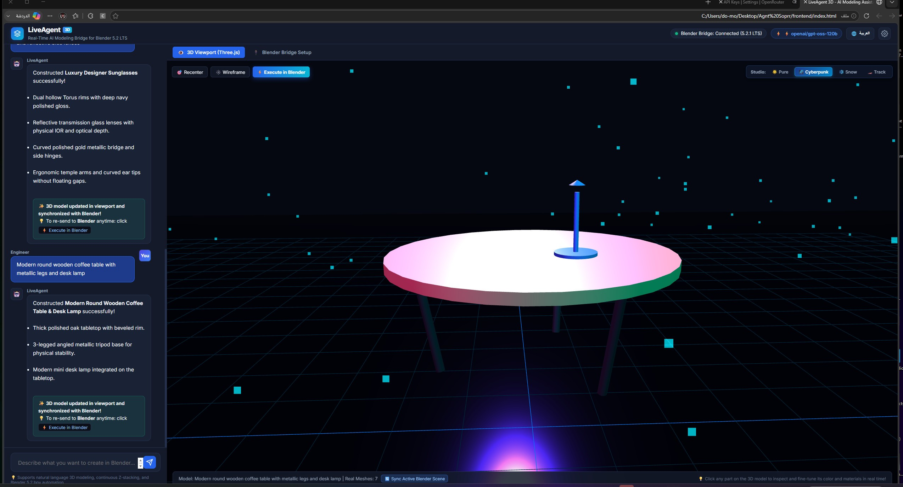
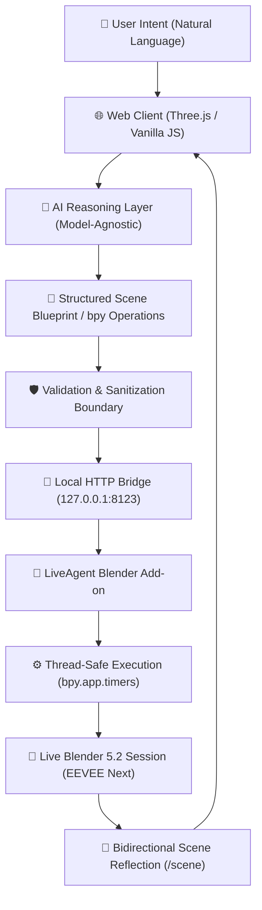

# LiveAgent 3D — Direct AI-to-Blender Agent 🚀

[](https://www.blender.org/)
[](LICENSE)
[](https://www.fmas.dev/)

> **A model-agnostic, real-time AI-to-Blender execution pipeline built around a direct local bridge, structured scene blueprints, and a live Three.js feedback loop.**

LiveAgent 3D translates natural-language 3D intent into structured, parametric scene operations and executes them deterministically inside an active **Blender 5.2 LTS (EEVEE Next)** session via a lightweight local execution bridge.

```text
Natural language → AI reasoning → Structured scene blueprint → Local execution bridge → Live Blender → Three.js feedback
```

The central architectural idea of the project:

> **The AI decides WHAT should happen.**  
> **The execution layer controls HOW that decision is safely applied to Blender.**

---

## 📸 Visual Showcase & Live Demonstrations

| Real-Time Live Sync (Blender 5.2 + Web Viewport) | Interactive Material & Color Inspector |
| :---: | :---: |
|  |  |

| Procedural Sci-Fi Spaceship & VFX Thrusters | Cyberpunk Studio Viewport |
| :---: | :---: |
|  |  |

> 📹 **Walkthrough Video:** A full video recording demonstrating the bidirectional synchronization loop is available at [`assets/demo_video_realtime_pipeline.mp4`](assets/demo_video_realtime_pipeline.mp4).

---

## 🏛️ Why This Architecture? (Direct Pipeline vs. Generic Stacks)

Many AI-to-Blender experiments rely either on manual copy-pasting of raw Python code or on heavyweight, multi-layered tool protocols (such as generic MCP stacks) that introduce unnecessary architectural overhead for direct, single-user workflows.

LiveAgent 3D makes a deliberate, application-specific engineering decision: **provide a minimal, purpose-built direct execution path between the AI agent and the local Blender instance.**

### Architecture Comparison

#### 1. Traditional Multi-Hop Protocol Stack (e.g., General MCP)
```text
LLM Client ──► MCP Client ──► MCP Server ──► TCP/WebSocket ──► Blender Add-on ──► bpy ──► Blender
```
*Intended for: multi-tool discovery across IDEs, enterprise tool brokering, and multi-client interoperability.*

#### 2. LiveAgent 3D Direct Execution Pipeline (This Project)
```text
User Intent ──► Web Client (Three.js) ──► Model-Agnostic AI ──► Scene Blueprint ──► Sanitizer ──► Local Bridge (127.0.0.1) ──► bpy.app.timers ──► Blender 5.2 ──► Three.js Reflection
```
*Intended for: direct, low-latency, application-specific execution between natural language, an AI agent, Blender, and a real-time visual canvas.*



---

## ⚙️ Core Engineering Principles

### 1. Model-Agnostic AI Layer
The Blender execution layer does not depend on any single proprietary model. The system routes structured generation through a unified interface supporting:
- **Groq Cloud** (`qwen/qwen3.8-27b`, `openai/gpt-oss-120b`, `llama-3.3-70b`) — ultra-fast LPU inference.
- **Google Gemini** (`gemini-1.5-flash`, `gemini-2.5-flash`) — extensive contextual window.
- **OpenRouter** & **Local Models (Ollama / Open-Source)** — privacy-first offline workflows.

> **Engineering Principle:** The AI provider can change tomorrow without altering a single line of the Blender integration or bridge code.

### 2. AI Reasoning ≠ Blender Execution
The AI is never treated as the Blender runtime. Instead, an explicit boundary is enforced:
1. **AI Layer:** Interprets natural language and outputs parametric scene blueprints.
2. **Sanitization Layer:** Upgrades deprecated properties, strips invalid syntax, and normalizes modern Blender 5.2 sockets.
3. **Execution Layer:** Controls the Blender boundary, ensuring execution happens deterministically on Blender's terms.

### 3. Thread-Safe Execution via `bpy.app.timers`
Blender’s C/Python API (`bpy`) is not thread-safe and must be evaluated on Blender's main thread. Rather than injecting unsafe asynchronous calls that cause viewport freezing or crash Blender, the bridge leverages `bpy.app.timers` to safely schedule and evaluate operations inside Blender's native event loop.

### 4. Deterministic Object-Mode Primitive Assembly
To eliminate geometric fragmentation and invalid manifold topology, models are synthesized using deterministic Object-Mode transformations (`bpy.ops.mesh.primitive_*_add`) with explicit dimensions, coordinates, and rotation vectors, avoiding fragile edit-mode extrusions.

### 5. Blender 5.2 LTS & EEVEE Next Compatibility Standards
All materials and lighting dynamically conform to modern Blender 5.2 LTS specifications:
- Principled BSDF standard sockets: `Transmission Weight`, `Specular IOR Level`, `Emission Color`, `Coat Weight`, `Subsurface Weight`.
- Obsolete EEVEE legacy properties (`material.shadow_method`, `scene.eevee.use_bloom`, `scene.eevee.use_ssr`) are automatically intercepted and sanitized.

### 6. Closed Real-Time Feedback Loop
Blender acts as the **Execution Source of Truth**. The browser canvas (Three.js WebGL) provides immediate, interactive visual reflection. Clicking any element in the web Part Inspector immediately updates color, roughness, and metallic properties across both Three.js and Blender simultaneously in real time.

---

## 🧩 Component Responsibilities

| Component | Responsibility | Technology |
|---|---|---|
| **Web Client** | User interaction, chat HUD, Three.js 3D viewport, Part Inspector HUD, provider routing | HTML5, CSS3, Vanilla JS, Three.js WebGL |
| **AI Provider** | Intent interpretation, spatial decomposition, blueprint emission | Groq LPU, Google Gemini, OpenRouter, Local LLMs |
| **Blueprint Layer** | Structured representation of intended 3D hierarchy, dimensions, and materials | Parametric JSON & bpy Schema |
| **Validation Layer** | Code sanitization, Blender 5.2 API upgrading, syntax verification | Regex-based AST & Python sanitizer |
| **Local Bridge Server** | Thread-safe HTTP transport bound to `127.0.0.1:8123` | Python `http.server` running inside Blender |
| **Blender Add-on** | Receives operations, queues execution via `bpy.app.timers`, serializes scene state | Blender Python Add-on (`bl_info`, `blender_manifest.toml`) |
| **Blender 5.2** | Final geometric truth, PBR shader compilation, EEVEE Next rendering | Blender 5.2.1 LTS Core |

---

## ⚡ Quick Start

### 1. Requirements
- **Blender 5.2 LTS** (recommended) or **Blender 4.2 LTS**.
- Modern web browser (Chrome, Edge, Firefox, Brave).
- API Key from [Groq Cloud Console](https://console.groq.com) (free & ultra-fast) or [Google AI Studio](https://aistudio.google.com).

### 2. Setup the Blender Bridge (One-Time)
#### Option A: Quick Launch Shortcut (Windows)
Double-click `launch_blender_bridge.bat` in the project folder. It launches Blender with the bridge active automatically.

#### Option B: Install the Official Add-on
1. In Blender, open **Edit** > **Preferences** > **Add-ons**.
2. Click the gear icon ⚙️ (or arrow) at the top right and select **Install from Disk...**
3. Select `frontend/liveagent_bridge.zip` (or download it directly from the web UI).
4. Enable the checkbox for **LiveAgent 3D Bridge**.
5. The local bridge server starts automatically on `http://127.0.0.1:8123`. Press `N` in Blender's 3D Viewport to inspect the LiveAgent status tab.

### 3. Launch the Web Interface
Open `frontend/index.html` directly in your browser, or serve it via any static server:
```bash
# Using Python
python -m http.server 3000 --directory frontend

# Using Node.js
npx serve frontend
```

### 4. Connect & Build
1. Click the **Settings ⚙️** icon in the top header.
2. Select your provider (**Groq Cloud** or **Google Gemini**), paste your API key, and save.
3. Switch interface language anytime using the **🌐 العربية / English** button in the header.
4. Try one of the certified blueprints (e.g. *Master Velvet Rose*, *Luxury Sunglasses*, *Coffee Table & Lamp*) or type any natural-language prompt.

---

## 🛡️ Security Boundary & Operational Constraints

- **Localhost Boundary:** The execution bridge is intentionally bound to `127.0.0.1`. It does not expose external network ports without deliberate configuration.
- **Layered Validation:** Generated code passes through string and AST-level sanitizers that strip unsafe operating-system primitives and enforce isolated Blender data manipulation.
- **Realistic Limitations:**
  - Complex non-primitive organic sculpting requires iterative prompting.
  - Three.js WebGL visualization is an interactive reflection layer; final raytraced lighting is governed by Blender's EEVEE Next / Cycles engine.
  - Generative fidelity depends on the reasoning capability of the connected LLM.

---

## 📂 Project Structure

```text
liveagent-blender/
├── assets/                     # Live demo screenshots & video demonstration
├── frontend/
│   ├── index.html              # Main web interface (Three.js viewport + Chat HUD)
│   ├── app.js                  # 3D renderer, AI router, bridge client, inspector
│   ├── style.css               # Modern dark-mode responsive styling
│   └── liveagent_bridge.zip    # Pre-packaged Blender 5.2 add-on
├── blender_addon/
│   ├── live_bridge.py          # Standalone socket server script
│   └── liveagent_bridge/       # Blender add-on package source (__init__.py)
├── backend/                    # Optional headless FastAPI server
│   ├── server.py
│   ├── agent.py
│   └── requirements.txt
├── launch_blender_bridge.bat   # One-click Windows startup script
├── LICENSE                     # MIT License
└── README.md                   # Technical documentation
```

---

## 🗺️ Roadmap

- [x] **Phase 1: Core Pipeline** — Direct bridge, model-agnostic provider routing, Blender 5.2 EEVEE Next compatibility, Three.js live reflection.
- [x] **Phase 2: Bilingual UI & Certified Blueprints** — Real-time Arabic/English I18N localization, deterministic Fibonacci rose, procedural sunglasses, and furniture archetypes.
- [ ] **Phase 3: Deep Agentic Interaction** — Multi-turn scene modification, object-level spatial targeting, and undo/redo state sync.
- [ ] **Phase 4: Local Model Integration** — Native Ollama / llama.cpp local inference with pre-configured 3D system prompts for 100% offline air-gapped operation.

---

## 👨‍💻 Author & Lead Engineer

**Eng. Fahim  Almas**  
*AI Agents & Systems Architect | 3D Procedural Engineering Specialist*

* 🌐 **Portfolio & Website:** [https://www.fmas.dev/](https://www.fmas.dev/)
* 🐙 **GitHub Profile:** [@fahimalmas](https://github.com/fahimalmas)
* ✉️ **Contact:** [fahim@fmas.dev](mailto:fahim@fmas.dev)

---

## 📄 License

Distributed under the MIT License. See `LICENSE` for more information.  
Copyright (c) 2026 Fahim Almas (FAHIM ALMAS - fmas.dev). All rights reserved.