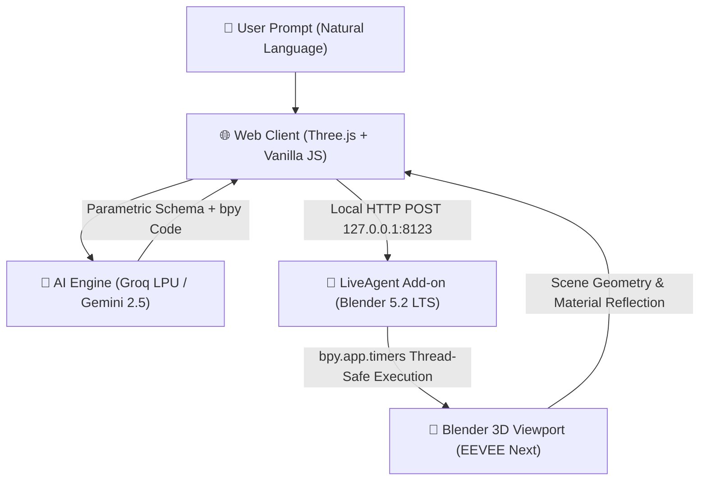

# LiveAgent 3D: Real-Time AI Agent Bridge for Blender 5.2 LTS 🚀

[](https://www.blender.org/)
[](LICENSE)
[](https://www.fmas.dev/)
[](https://www.credly.com/badges/34d55684-10d4-4a96-b5bc-775f45df7a28/public_url)
[](https://omp.dub.ai/certificate/gS2r9rr9EkiN)

> **LiveAgent 3D** is an open, modular system connecting modern web interfaces (Three.js WebGL) with **Blender 5.2 LTS** in real time. It pairs specialized LLM reasoning with a local execution bridge, allowing natural language prompts to produce production-ready 3D geometry, procedural materials, and lighting directly inside Blender.

---

## 👨‍💻 Developer & Author

Designed and engineered by **Eng. Fahim Salem Almas (فاهم سالم الماس)**
- 🌐 **Personal Website:** [fmas.dev](https://www.fmas.dev/)
- 🐙 **GitHub:** [@fahimalmas](https://github.com/fahimalmas)
- 🏅 **Certifications & Badges:**
  - [Google Cloud Vertex AI Prompt Design (Credly)](https://www.credly.com/badges/34d55684-10d4-4a96-b5bc-775f45df7a28/public_url)
  - [Dubai Future Foundation — 1 Million Prompters](https://omp.dub.ai/certificate/gS2r9rr9EkiN)
  - Author of [Sanad AI Decision Engine](https://github.com/fahimalmas/sanad_ai_decision_engine)

---

## 🏛️ System Architecture



### Architectural Principles:
1. **Thread-Safe Command Queue**: Blender's Python API (`bpy`) requires execution on the main application thread. The bridge utilizes `bpy.app.timers` to safely dequeue and evaluate operations without causing viewport hitching or thread race conditions.
2. **Object Mode Primitive Assembly**: Meshes are synthesized purely via deterministic Object Mode transforms (`bpy.ops.mesh.primitive_*_add`) rather than fragile edit-mode extrusions, ensuring 100% reproducibility across various model geometries.
3. **Blender 5.2 LTS & EEVEE Next Standards**:
   - Modern Principled BSDF socket interfaces (`Transmission Weight`, `Specular IOR Level`, `Emission Color`).
   - Deprecated attributes (such as `shadow_method` or legacy `use_bloom`) are sanitized by design.
4. **Dual Feedback Loop**: Geometry is visually simulated in the browser canvas using Three.js while simultaneously rendered in Blender with accurate physically-based materials (PBR).

---

## 🧩 Blueprint & Skill System Design

The generation engine relies on **parametric blueprints** designed to bridge natural language prompts into geometric primitives:

- **Modular Archetypes**: Blueprints structure complex objects (e.g., glassware, mechanical assets, consumer products) into hierarchical components (base, body, accents, materials).
- **Extensibility**: The codebase is intentionally structured so any developer can create new blueprints. By studying the official [Blender Python API Documentation](https://docs.blender.org/api/current/) and adhering to the coordinate conventions in `app.js`, new 3D schemas can be contributed with minimal effort.
- **Auto-Sanitization**: Incoming Python code is filtered and sanitized through a runtime pre-processor that upgrades legacy properties and wraps execution in safe recovery blocks.

---

## ⚡ Quick Start

### 1. Prerequisites
- **Blender 4.2 LTS or 5.2 LTS** installed on your system.
- Modern web browser (Chrome, Edge, Firefox, Brave).
- An API Key from [Groq Cloud Console](https://console.groq.com) (recommended: free & ultra-fast) or [Google AI Studio](https://aistudio.google.com).

### 2. Install the Blender Add-on
1. Open Blender.
2. Navigate to **Edit** > **Preferences** > **Add-ons**.
3. Click the top-right arrow/menu and choose **Install from Disk...**
4. Select `liveagent_bridge.zip` (located in `frontend/liveagent_bridge.zip` or download it directly from the web interface).
5. Enable the checkbox for **LiveAgent 3D Bridge**.
6. The bridge will start automatically on `http://127.0.0.1:8123`. Press `N` in Blender's 3D Viewport to inspect the LiveAgent status tab.

### 3. Launch the Web Interface
Simply open `frontend/index.html` in your browser, or serve it locally:
```bash
# Using Python
python -m http.server 3000 --directory frontend

# Using Node.js (npx)
npx serve frontend
```

### 4. Configure & Create
1. Click the **Settings ⚙️** icon in the web app header.
2. Select **Groq Cloud** (or **Google Gemini**), paste your API key, and save.
3. Type any 3D design prompt (e.g., *"Modern low-poly sports car"*, *"Frosted glass perfume bottle"*, *"Ergonomic office chair"*).
4. Watch the 3D model render instantly in your browser and synchronize live with your running Blender instance!

---

## 📂 Project Structure

```
liveagent-3d/
├── frontend/
│   ├── index.html              # Main web interface (Three.js viewport + Chat HUD)
│   ├── app.js                  # 3D renderer, AI router, bridge client, inspector
│   ├── style.css               # Modern dark-mode responsive styling
│   └── liveagent_bridge.zip    # Pre-packaged Blender 5.2 add-on
├── blender_addon/
│   ├── live_bridge.py          # Standalone socket server script
│   └── liveagent_bridge/       # Blender add-on package source (__init__.py)
├── backend/                    # Optional headless FastAPI server
│   ├── server.py
│   ├── agent.py
│   └── requirements.txt
├── launch_blender_bridge.bat   # One-click Windows startup script
├── GEMINI.md                   # Agent system guidelines & rules
└── README.md                   # Project documentation
```

---

## 🛡️ License

Distributed under the **MIT License**. Feel free to use, modify, and build upon this architecture. Contributions and pull requests are welcome!

---

Developed with precision by [Eng. Fahim Almas](https://www.fmas.dev/) • 2026
